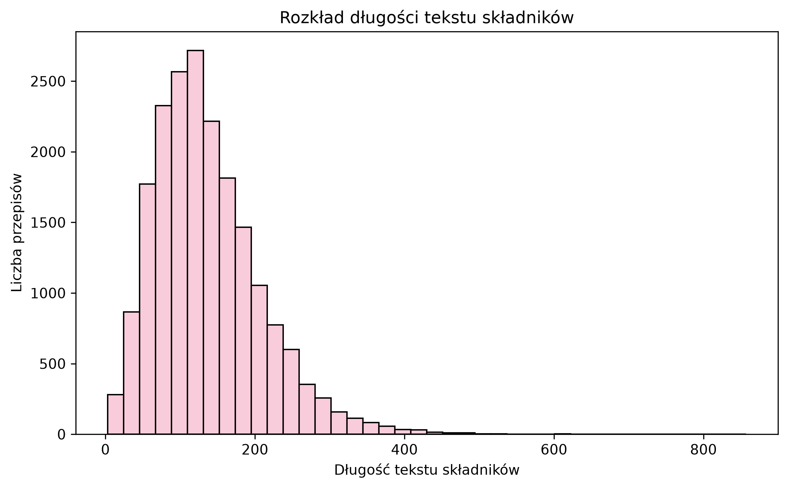
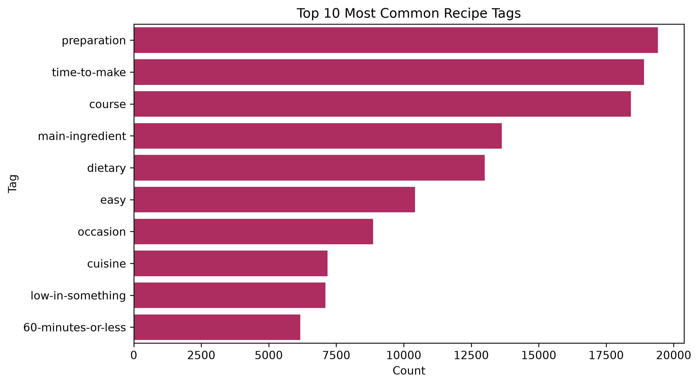

# Recipe Recommendation System

## Opis projektu

Celem projektu jest stworzenie prostego systemu rekomendacji przepisów.
Projekt działa tak, że na podstawie wybranego przepisu system wyszukuje podobne przepisy. 
Podobieństwo jest liczone na podstawie tekstu, czyli głównie nazwy przepisu, składników, opisu, instrukcji przygotowania oraz tagów.

## Dane

Dane pochodzą z Kaggle: **Food.com Recipes with Ingredients and Tags**.

Zbiór danych zawierał początkowo:

- 500471 przepisów,
- 9 kolumn.

W projekcie wykorzystałam m.in. kolumny:

- `name`,
- `description`,
- `ingredients`,
- `ingredients_raw`,
- `steps`,
- `servings`,
- `serving_size`,
- `tags`.

Ponieważ zbiór był bardzo duży, do dalszej analizy i budowy systemu rekomendacji wykorzystałam próbkę danych. Po czyszczeniu końcowy zbiór zawierał:

- 19582 przepisy,
- 10 kolumn,
- 0 brakujących wartości.

## Cel projektu

Główne cele projektu:

- wczytanie i przygotowanie danych o przepisach,
- podstawowe czyszczenie tekstu,
- wykonanie prostej eksploracyjnej analizy danych,
- zbudowanie systemu rekomendacji przepisów,
- sprawdzenie, czy rekomendacje są sensowne dla kilku przykładów.

## Użyte technologie

W projekcie wykorzystałam:

- Python,
- pandas,
- numpy,
- matplotlib,
- seaborn,
- scikit-learn.

## Struktura projektu

- `src/` - folder z plikami `.py`,
- `images/` - folder z wykresami,
- `README.md` - opis projektu,
- `requirements.txt` - lista użytych bibliotek.

## Etapy projektu

### 1. Wczytanie danych

Na początku wczytałam plik CSV i sprawdziłam podstawowe informacje o danych:

- liczbę wierszy i kolumn,
- typy danych,
- nazwy kolumn,
- pierwsze obserwacje,
- liczbę brakujących wartości.

Zbiór miał początkowo 500471 wierszy i 9 kolumn.

### 2. Czyszczenie danych

W etapie czyszczenia danych:

- wybrałam najważniejsze kolumny,
- usunęłam duplikaty,
- usunęłam wiersze bez nazwy przepisu, składników lub instrukcji,
- uzupełniłam brakujące wartości w kolumnach tekstowych,
- zamieniłam tekst na małe litery,
- usunęłam niektóre znaki specjalne,
- utworzyłam kolumnę `combined_text`.

Kolumna `combined_text` łączy kilka informacji o przepisie:

- nazwę przepisu,
- opis,
- składniki,
- kroki przygotowania,
- tagi.

Ta kolumna była potem używana do liczenia podobieństwa między przepisami.

### 3. Eksploracyjna analiza danych

W ramach EDA sprawdziłam długość tekstu składników, długość instrukcji przygotowania oraz najczęściej występujące tagi.

### Rozkład długości tekstu składników

### Najczęstsze tagi przepisów

## System rekomendacji

System rekomendacji został zbudowany na podstawie podobieństwa tekstowego między przepisami.

Do zamiany tekstu na liczby wykorzystałam metodę **TF-IDF**. Następnie podobieństwo między przepisami zostało policzone za pomocą **cosine similarity**.

W skrócie:

- każdy przepis został opisany tekstem w kolumnie `combined_text`,
- tekst został zamieniony na reprezentację liczbową,
- dla wybranego przepisu system porównuje go z innymi przepisami,
- na końcu zwraca przepisy najbardziej podobne.

## Przykładowe rekomendacje

Dla przepisu:

**Chocolate Pie**

system zwrócił m.in.:

| Rekomendowany przepis | Wynik podobieństwa |
|---|---:|
| Tofu Chocolate Pie | 0.5253 |
| Chocolate Cream Pie from Gourmet.com | 0.4971 |
| Grasshopper Pie | 0.4791 |
| Dark Chocolate Chess Pie | 0.4671 |
| Captain's Chocolate Pie | 0.4579 |

Dla przepisu:

**Banana Bread**

system zwrócił m.in.:

| Rekomendowany przepis |      Wynik podobieństwa |
|---|------------------------:|
| Moist Banana Bread |                  0.5494 |
| Mels Basic Banana Bread |                  0.5286 |
| Melt in Your Mouth Banana Bread |                  0.5268 |
| Guatemalan Banana Bread |                  0.5214 |
| Coconut Chocolate Chip Banana Bread |                  0.5083 |

Wyniki pokazują, że system potrafi znaleźć przepisy podobne tematycznie, np. inne wersje ciasta czekoladowego.

## Wnioski

Na podstawie projektu można zauważyć, że:

- TF-IDF i cosine similarity dobrze sprawdzają się w prostym systemie rekomendacji tekstowych,
- składniki, nazwa przepisu i tagi są przydatne do szukania podobnych przepisów,
- rekomendacje dla przykładów takich jak `Chocolate Pie` i `Banana Bread` były sensowne,
- system rekomendacji nie wymaga zmiennej docelowej, ponieważ opiera się na podobieństwie między obiektami.

System nie uwzględnia jednak opinii użytkowników, ocen przepisów ani indywidualnych preferencji smakowych. Rekomendacje są oparte tylko na podobieństwie tekstu.
Dodatkowo wykorzystałam próbkę danych, ponieważ pełny zbiór danych był bardzo duży.

